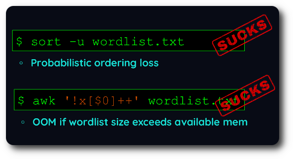
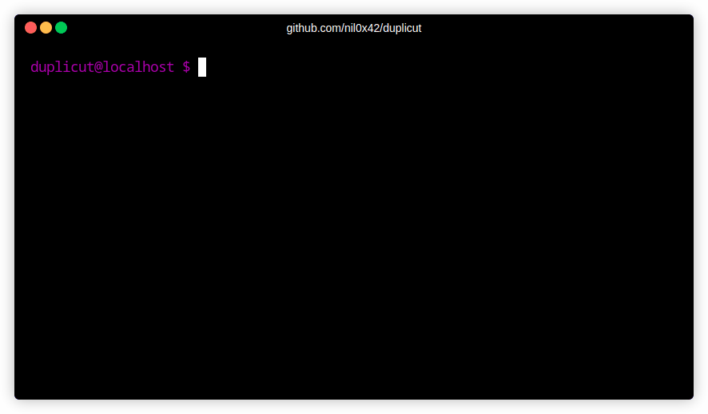

<h1 align="center">Duplicut :scissors:</h1>

<h3 align="center">
    Quickly dedupe massive wordlists, without changing the order
    <a href="https://twitter.com/intent/tweet?text=Duplicut%3A%20Remove%20duplicates%20from%20MASSIVE%20wordlist%2C%20without%20sorting%20it%20(for%20dictionnary-based%20password%20cracking)%20-%20by%20%40nil0x42&url=https://github.com/nil0x42/duplicut">
      
    </a>
</h3>
<br>

<p align="center">
  <a href="https://github.com/nil0x42/duplicut/actions/workflows/tests.yml?query=branch%3Amaster" target="_blank">
    
  </a>
  <a href="https://app.codacy.com/gh/nil0x42/duplicut/dashboard" target="_blank">
    
  </a>
  <a href="https://github.com/nil0x42/duplicut/actions/workflows/codeql.yml?query=branch%3Amaster" target="_blank">
    
  </a>
  <a href="https://codecov.io/gh/nil0x42/duplicut" target="_blank">
    
  </a>
</p>

<p align="center">
  <a href="https://github.com/enaqx/awesome-pentest#hash-cracking-tools" target="_blank">
    
  </a>
  <a href="https://inventory.raw.pm/tools.html#Duplicut" target="_blank">
    
  </a>
  <a href="https://www.blackarch.org/misc.html" target="_blank">
    
  </a>
  </a>
  <a href="https://x.com/intent/follow?screen_name=nil0x42" target="_blank">
    
  </a>
</p>

<div align="center">
  <sub>
    Created by
    <a href="https://twitter.com/nil0x42">nil0x42</a> and
    <a href="https://github.com/nil0x42/duplicut/graphs/contributors">contributors</a>
  </sub>
</div>

<br>

* * * * * * * * * * * * * * * * * * * * * * * * * * * * * * * * * * *

<a href="#"></a>

### :book: Overview

Nowadays, password wordlist creation usually implies concatenating
multiple data sources.

Ideally, most probable passwords should stand at start of the wordlist,
so most common passwords are cracked instantly.


With existing *dedupe tools* you are forced to choose
if you prefer to *preserve the order **OR** handle massive wordlists*.

Unfortunately, **wordlist creation requires both**


> **So i wrote duplicut in [highly optimized C][get-next-line] to address this very specific need :nerd\_face: :computer:**

<a href="#"></a>
<br>

* * * * * * * * * * * * * * * * * * * * * * * * * * * * * * * * * * *

### :bulb: Quick start

```sh
git clone https://github.com/nil0x42/duplicut  # download ...
cd duplicut/ && make                           # compile ...
./duplicut wordlist.txt -o clean-wordlist.txt  # dedupe !!!
```

### :wrench: Options

```
-o, --outfile <FILE>       Write result to <FILE>
-t, --threads <NUM>        Max threads to use (default max)
-m, --memlimit <VALUE>     Limit max used memory (default max)
-l, --line-max-size <NUM>  Max line size (default 1024, max 4095)
-p, --printable            Filter ascii printable lines
-c, --lowercase            Convert wordlist to lowercase
-C, --uppercase            Convert wordlist to uppercase
-D, --dupfile <FILE>       Write dupes to <FILE> (slows down duplicut)
-h, --help                 Display this help and exit
-v, --version              Output version information and exit
```

*   **Features**:
    *   Handle massive wordlists, even those whose size exceeds available RAM
    *   Filter lines by max length (`--line-max-size` option)
    *   Filter-out lines with non-printable ASCII chars (`--printable` option)
    *   Save found duplicates to another file (`--dupfile` option)
    *   Ignore case with `--lowercase` or `--uppercase` options
    *   Displays a nice progress bar with ETA

*   **Implementation**:
    *   Written in pure C code, designed to be fast
    *   Compressed hashmap items on 64 bit platforms
    *   Multithreading support

*   **Limitations**:
    *   `--line-max-size` can't exceed 4095

### :book: Technical Details

#### :small_orange_diamond: 1- Memory optimized:

An `uint64` is enough to index lines in hashmap, by packing
`size` info within pointer's [extra bits][tagged-pointer]:

![][img-2-line-struct]

#### :small_orange_diamond: 2- Massive file handling:

If whole file can't fit in memory, it is split into ![][latex-n]
virtual chunks, in such way that each chunk uses as much RAM as possible.

Each chunk is then loaded into hashmap, deduped, and tested against
subsequent chunks.

That way, execution time decreases to at most ![][latex-n]th *triangle number*:

![][img-3-chunked-processing]

## :bulb: Throubleshotting

If you find a bug, or something doesn't work as expected,
please compile duplicut in debug mode and post an [issue] with
attached output:

```
# debug level can be from 1 to 4
make debug level=1
./duplicut [OPTIONS] 2>&1 | tee /tmp/duplicut-debug.log
```

[get-next-line]: https://github.com/nil0x42/duplicut/blob/master/src/line.c#L39

[img-2-line-struct]: .github/images/2-line-struct.png
[img-3-chunked-processing]: .github/images/3-chunked-processing.png
[img-4-help]: .github/images/4-help.png

[issue]: https://github.com/nil0x42/duplicut/issues
[tagged-pointer]: https://en.wikipedia.org/wiki/Tagged_pointer

[latex-n]: http://www.sciweavers.org/tex2img.php?fs=15&eq=n
[latex-nth-triangle]: http://www.sciweavers.org/tex2img.php?fs=32&eq=%5Csum_%7Bk%3D1%7D%5Enk
